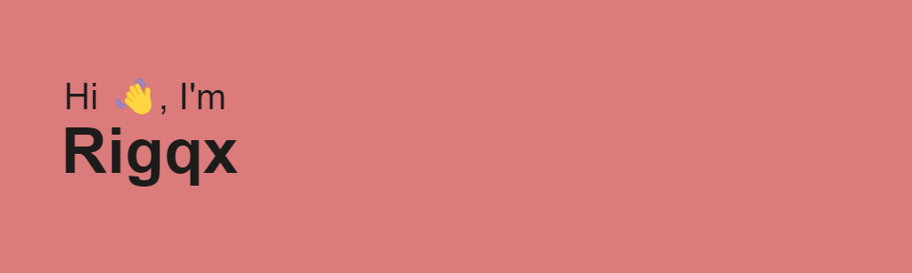

<!-- header image -->

# Hey, I'm Rigqx 👋  
*Young Danish dev, rocking both frontend and backend.*

---

  

---

## 🚀 Portfolio  
Check out my work: [rigqx.dk](https://rigqx.dk)

---

## 🛠️ Tech Stack  

  
  
  
  
  
  
  
  
  

---

## 📊 GitHub Stats

  

  

---

*Made with 💻 and ☕*  

